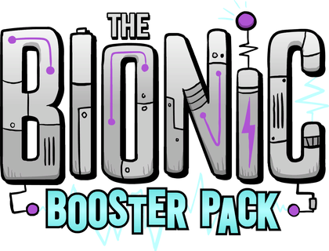

# 🧰 Toolbox Not Included

  

    
    
    
    
  

 

A collection of useful tools, calculators, and utilities for Oxygen Not Included. Because some things *should* be included.

This project provides helpful calculators and planning tools to help your Duplicants survive (and thrive!) on the asteroid.

## 📖 Wiki / Guides

[➡️ **Go to Wiki**](./docs/README.md)

---

## 📄 License

This project is distributed under the MIT License. See the `LICENSE` file for more information.

---

*Oxygen Not Included and its assets are copyright © Klei Entertainment Inc.*